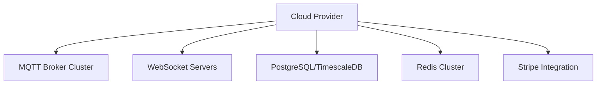

# Production Deployment Guide

## Core Infrastructure Requirements



## MQTT Broker Setup

### self hosted MQTT Broker

```yaml
# docker-compose-mqtt.yml
version: "3.8"
services:
  mqtt:
    image: ghcr.io/moscajs/aedes-server
    ports:
      - "1883:1883"
      - "8883:8883"
    volumes:
      - ./certs:/certs
    environment:
      AUTH_MECHANISM: cert
      TLS_KEY: /certs/server.key
      TLS_CERT: /certs/server.crt
```

### Kubernetes Deployment

```yaml
# k8s/backend-deployment.yaml
apiVersion: apps/v1
kind: Deployment
metadata:
  name: api-server
spec:
  replicas: 3
  selector:
    matchLabels:
      app: api
  template:
    metadata:
      labels:
        app: api
    spec:
      containers:
        - name: api
          image: registry.gitlab.com/yourcompany/api:latest
          ports:
            - containerPort: 3000
          envFrom:
            - secretRef:
                name: api-secrets
```

### GitHub Actions Example

```yaml
# .github/workflows/deploy.yml
name: Production Deployment

on:
  push:
    branches: [main]

jobs:
  deploy:
    runs-on: ubuntu-latest
    steps:
      - name: Checkout
        uses: actions/checkout@v4

      - name: Docker Build
        uses: docker/build-push-action@v5
        with:
          context: .
          tags: registry.gitlab.com/yourcompany/api:latest

      - name: Deploy to AWS
        uses: aws-actions/configure-aws-credentials@v4
        with:
          aws-access-key-id: ${{ secrets.AWS_KEY }}
          aws-secret-access-key: ${{ secrets.AWS_SECRET }}
          aws-region: us-west-2
      - run: kubectl rollout restart deployment/api-server
```
