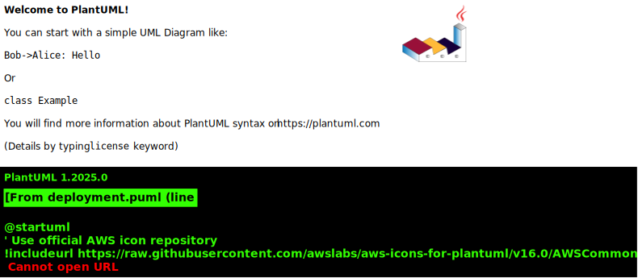

## Infrastructure

- AWS EKS Cluster
- Managed PostgreSQL
- Redis Cloud
- NGINX Ingress
  - MQTT TLS Termination:
    ```nginx
    stream {
      server {
        listen 8883 ssl;
        ssl_certificate /etc/ssl/certs/mqtt.crt;
        ssl_certificate_key /etc/ssl/private/mqtt.key;
        proxy_pass mqtt_backend;
      }
    }
    ```

## CI/CD Pipeline

1. GitHub Actions →
2. Docker Build →
3. Trivy Scan →
4. ArgoCD Rollout

## Monitoring

- Prometheus/Grafana
- AWS CloudWatch
- Sentry Error Tracking

## System Architecture



